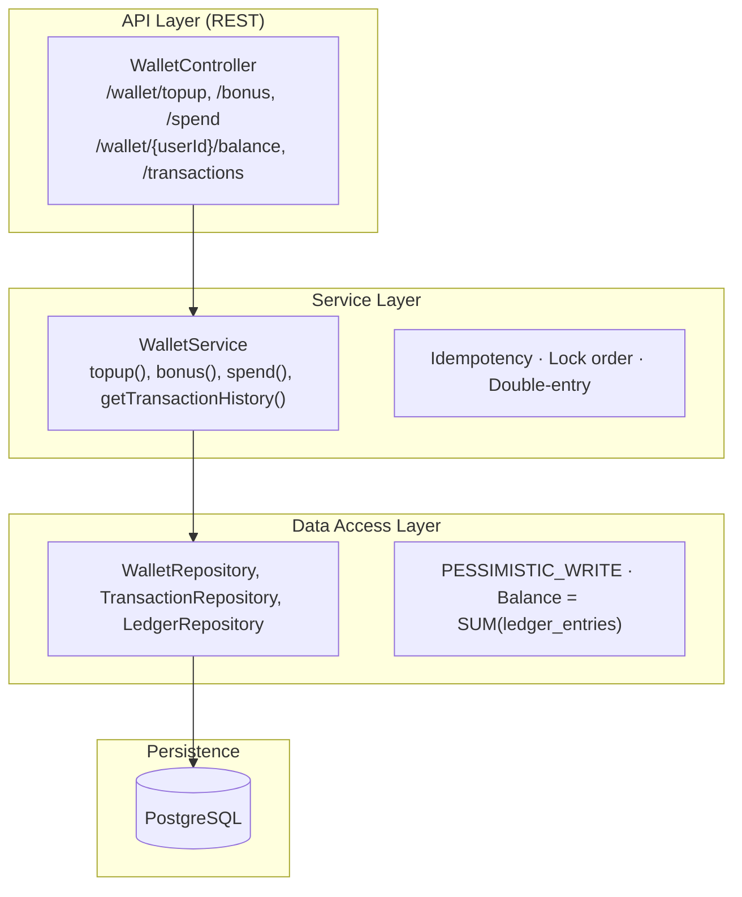
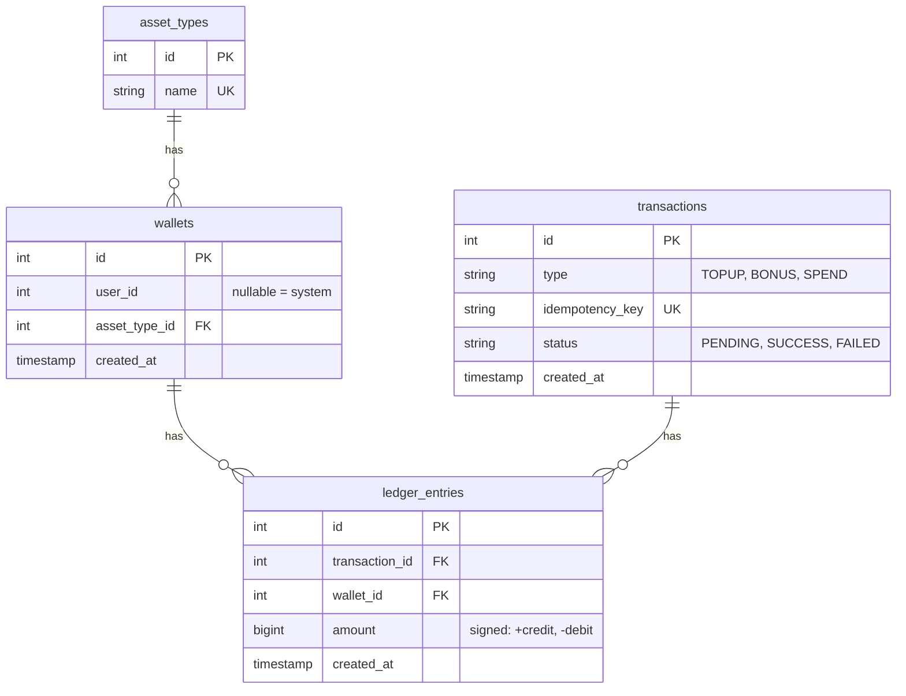
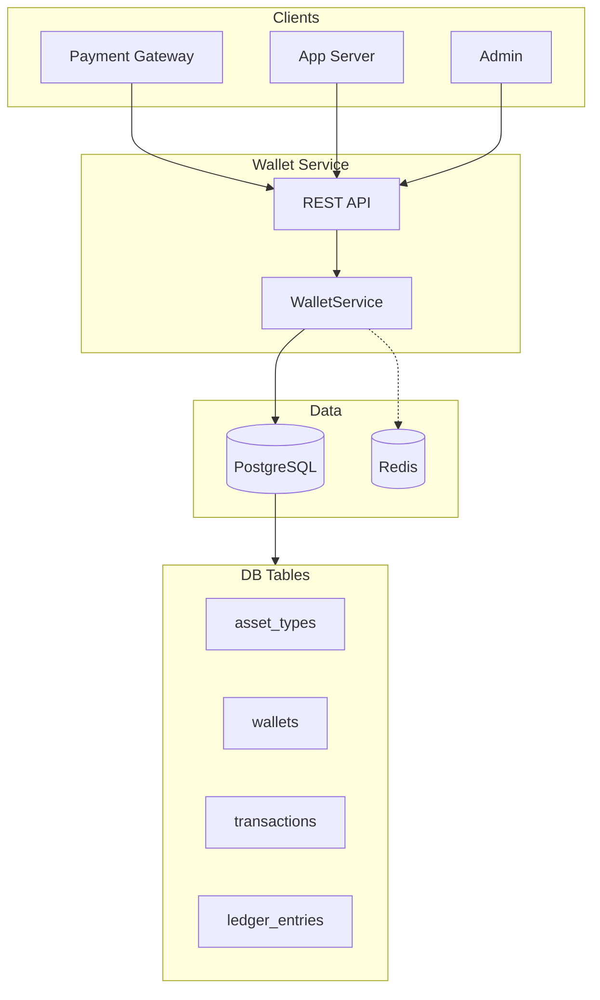

# Internal Wallet Service

Wallet service for a high-traffic application like a gaming platform or a loyalty rewards system. This service keeps track of each user's balance of application-specific credits or points (for example, "Gold Coins" or "Reward Points").

---

## How to Run Application

Run the command:

```bash
docker compose up
```

- **Server:** http://localhost:8080  
- **PostgreSQL:** `localhost:5432` (user: `wallet`, password: `wallet123`, DB: `walletdb`)  
- **Redis:** Optional; when enabled, used for idempotency and balance cache.  
- **Adminer:** Optional DB UI (e.g. port 8090 when configured in Docker Compose).

---

## Seed Data

| Category | Data |
|----------|------|
| **Asset types** | Gold Coins, Diamonds, Loyalty Points |
| **System wallets** | Treasury (id=1), Bonus Pool (id=2), Revenue (id=3) for Gold Coins |
| **Users** | `userId=1` and `userId=2` with Gold Coins wallets and initial balances **500** and **300** respectively |

---

## API Endpoints

| Method | Path | Description |
|--------|------|-------------|
| `POST` | `/wallet/topup` | Credit user from Treasury (e.g. after payment). |
| `POST` | `/wallet/bonus` | Credit user from Bonus Pool (e.g. referral). |
| `POST` | `/wallet/spend` | Debit user, credit Revenue (in-app purchase). |
| `GET`  | `/wallet/{userId}/balance` | Get user balance (cached in Redis when enabled). |
| `GET`  | `/wallet/{userId}/transactions` | Get transaction history for user's wallet. |

**Idempotency:** Use header or request body **`Idempotency-Key`** (1–200 chars). Same key → same transaction id; no double credit/debit.

---

## Technology Choice

| Technology | Role |
|------------|------|
| **Java 21, Spring Boot 3** | REST, transaction management, validation |
| **PostgreSQL 15** | ACID, locking, ledger storage |
| **Flyway** | Schema and seed migration |
| **Redis** | Idempotency cache and balance cache |
| **Docker** | Postgres, Redis, Adminer, app |

---

## Entity Relation

| Entity | Table | Purpose |
|--------|-------|---------|
| **AssetType** | `asset_types` | Defines the kind of asset (e.g. Gold Coins, Diamonds, Loyalty Points). |
| **Wallet** | `wallets` | One account that holds one asset type. Either system (`user_id` NULL) or user (`user_id` set). |
| **Transaction** | `transactions` | One logical operation (TOPUP, BONUS, SPEND); has `idempotency_key`, `status`. |
| **LedgerEntry** | `ledger_entries` | One debit or credit line: links a transaction to a wallet with an amount (+ or −). |

### Relationships

- **AssetType → Wallet (1:N)** — DB: `wallets.asset_type_id` → `asset_types.id` (FK)
- **Wallet → LedgerEntry (1:N)** — DB: `ledger_entries.wallet_id` → `wallets.id` (FK)
- **Transaction → LedgerEntry (1:N)** — DB: `ledger_entries.transaction_id` → `transactions.id` (FK)

---

## HLD Diagrams

Paste the Mermaid blocks below into [mermaid.live](https://mermaid.live) to view or export.

### 1. Layered Architecture



### 2. Database Model



### 3. One-Page Overview



---

## Current Scope

The current scope of this project has implemented the following:

1. **Core domain** — Asset types, user accounts, system accounts (Treasury, Bonus Pool, Revenue).
2. **Double-entry ledger** — Every movement creates one transaction and two ledger entries (debit one wallet, credit another).
3. **Three operation types**
   - **TOPUP** — Treasury → user wallet  
   - **BONUS** — Bonus Pool → user wallet  
   - **SPEND** — User wallet → Revenue (in-app purchase)
4. **Idempotency** — Required for all POST APIs. Supplied via header or request body. Prevents duplicate mutations.
5. **Concurrency and integrity**
   - **Pessimistic locking** — Both wallets involved in a transfer are locked (`SELECT ... FOR UPDATE`) for the duration of the operation.
   - **Deadlock avoidance** — Locks always acquired in ascending wallet id order.
   - **Lock timeout and retry** — Optional DB `lock_timeout`; application retries with backoff on lock timeout / deadlock (configurable attempts and backoff).
   - **No negative balance** — Enforced on SPEND: balance checked after lock, before writing ledger entries.
6. **Caching** — Redis for GET balance and idempotency check for faster duplicate handling when enabled.
7. **Infrastructure and run**
   - **PostgreSQL** — Single database; schema and seed via Flyway (`V1__init.sql`, `V2__seed_data.sql`).
   - **Redis** — Used for idempotency and balance cache when configured.
   - **Docker Compose** — Run app, Postgres, Redis, Adminer with one command.
   - No authentication/authorization in this service (assumed to be handled by API gateway or upstream).
8. **Closed-loop system** — No transfer between two user wallets or to external systems.

---

## Future Scope

1. **Cron job or internal mechanism** to trigger bonus (e.g. scheduled or recurring rewards).
2. **Audit export / reports** — Export ledger or transactions for finance or compliance.
3. **Refund mechanism** — API or flow to reverse/refund (e.g. Revenue → user or Treasury → user).

---

